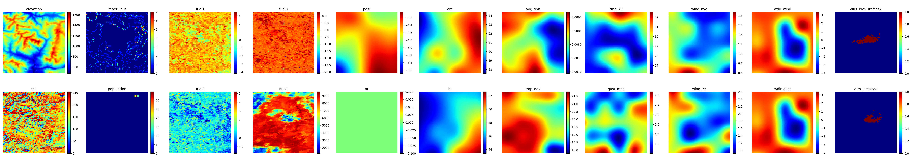

# Modified Next Day Wildfire Spread

Based on the dataset of Huot et al; [GitHub repo here](https://github.com/google-research/google-research/tree/master/simulation_research/next_day_wildfire_spread). 
This modified dataset is at higher spatial resolution and integrates more features, including fuel, than the original release of Huot et al. 

For more information on the dataset, see the presentation `slides/ndws_overview.pdf`. 

## Getting started (training models)
To start training models on the currently exported version of the dataset, first create a virtual environment using the included environment.yml file. Next, navigate to the public Google Cloud bucket associated with the project: [modified_ndws](https://console.cloud.google.com/storage/browser/modified_ndws). The dataset is in the folder `ndws_west_conus_dataset` and is composed of TfRecord and TfIndex files. Download the dataset to a local folder. 

Datasets and models are loaded using a loading utility function for ease of experimentation. The file `ndws_data_config.py` loads the TfRecord dataset into torch tensors that are training-ready. It offers many options for data augmentation, rescaling, and other operations on the raw data. 

The Jupyter notebook `model_training.ipynb` shows how json config files are used to load the dataset and to load different models. Some example architectures are included in the `model_configs` folder. 

Training and evaluation is handled by custom classes implemented in the `trainer.py` file. This also handles directory generation and automatically saves copies of the dataset and model configurations when the experiment is run. You can see how to use the `Evaluator` class in the notebook `model_evaluation`. 


## Creating new datasets
A main focus of this codebase is to facilitate the generation of new versions of the dataset (the `data_export` folder). This can be relatively complicated, and the code currently suffers from some overflow errors when trying to export over large areas with many features. These issues are commented at their location in the relevant code, and need to be addressed in further development. 

To export the dataset, you'll need to grab some assets hosted in the [Google Cloud bucket](https://console.cloud.google.com/storage/browser/modified_ndws). These assets must be uploaded to your Earth Engine account and project so that they can be accessed by the local code. You'll need the contents of `modified_ndws/latent_fuels_geotiffs` and the shapefiles in `modified_ndws/viirs_shapefiles`. You can download these files to your local machine and then upload to Earth Engine through the [online code editor](https://code.earthengine.google.com/), or use the command line interface, i.e.: 
```
    earthengine upload image --asset_id=projects/my-project/assets/asset_id gs://bucket/image.tif
```
Once these assets are uploaded to Earth Engine, you'll need to grab the asset IDs and add them to the `modified_ndws.env` environment file in comma-separated lists (see the current file for examples). 

The code is currently written to include an extra feature, a raw LANDFIRE fuel classification map. These can be downloaded via LANDFIRE [(link)](https://www.landfire.gov/data/FullExtentDownloads?field_version_target_id=All&field_theme_target_id=7&field_region_id_target_id=4), and subsequently uploaded to Earth Engine, or you can comment out these features and not include them. 

You'll also need to set up a Google Earth Engine account and install the associated command line tools [(instructions here)](https://developers.google.com/earth-engine/guides/python_install). Note that if/when you try to run Earth Engine in a Jupyter notebook, you'll need to create an API key (you'll be prompted in-notebook and sent with a link to an external page to create an API key with proper permssions, which include global editing scope for your Google account, so be careful).

The files `ee_utils.py` and `ee_export_utils.py` contain most of the relevant code for dataset creation. Both include feature specifications that need to be manually adjusted if you want to include or exclude any features. Currently, the data export process is run from the notebook `NDWS_Data_Export`, where options can be set in the config dict. 

As of this commit, the LANDFIRE and VIIRS data are not available over a proper date range directly through Earth Engine, which is why the whole song and dance with downloading and uploading large files is needed. In the case that these datasets do become available, the process should be significantly simplified. 

When exporting, you'll need a destination cloud bucket and folder specified, so will need to set up a Google Cloud account. 

#### Overflow errors
Currently, if a dataset is exported over a large enough area, overflow errors are thrown by Earth Engine, preventing sample extraction. This happens due to the size of the feature collections involved. Even if computations are not pulled explicitly client-side, calling the `.size()` method on a large feature collection can cause issues, for example in the function `_verify_feature_collection` in `ee_export_utils.py`. I've tried to alleviate this issue in a number of ways. The easiest is to do multiple dataset exports over small geographical areas. However, the export process should be able to be chunked in some fashion. See the [original codebase](https://github.com/google-research/google-research/tree/master/simulation_research/next_day_wildfire_spread) to see how it was handled, but that code threw similar errors for me when run w/o modification. **This issue needs to be addressed before a new export can be completed**. 

#### Data cleaning and analytics
Once the data is exported, statistics must be computed over the dataset and a cleaning process should be performed. The cleaning process is handled in the `dataset_analytics` notebook, where samples with below a minimum number of fire detections or above a certain level of impervious surface presence are dropped. Feature values are clipped to physically reasonable ranges, and statistics are computed across the dataset. Pre-computing statistics is crucial because the dataset is generally too large for memory and, since it is only iterable, cannot be globally standardized unless you iterate through all of it. Statistics for the currently exported version are available in this repo and are accessed by the data loading file. 


